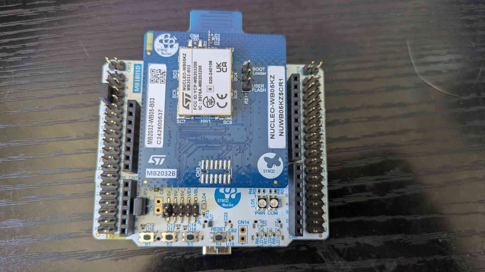
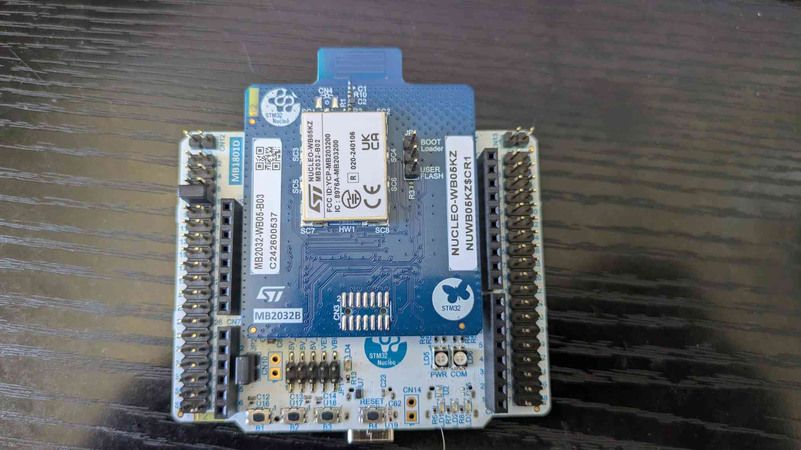

# Ambiance Playback Speaker Source

## description
A robust second generation solar speaker meant to play sound tracks on a schedule. This is being produced to help in the study of the interactions wild animals have with human voices. most project specific code is found in the core folder. however sme specific code is used the the STM32_BLE middleware.

## Installation

The project is compatable and tested with a Nucleo WB05KZ v1.1 devboard. There are two methods to download the project onto a board, through the STM32cubeIDE and the STM32cubeProgrammer. To use the IDE 
- first download the repository
- [download STM32cubeIDE](https://www.st.com/en/development-tools/stm32cubeide.html#get-software) from ST. 
- Next select import project. 
- Navigate to the folder with the repository and select the WPSsource folder within
- Next is to set up the micro controller. The devboard should come with 3 jumpers. Set them up so that one jumper is on connector CN 3 from pin 7 to pin 5, the sencond jumper is on JP2 near the devboard buttons, and finally the last jumper on JP1, 5VSTLK. Refer to image below
- plug a USB C cable into the board and into the computer eith the repository
- from there the code can be modified within the IDE and the device can be flashed by hitting the run button in the IDE

NOTE: do not program the device while it is plugged into the accompanying Abiance PCB.

The other method uses the programmer
- first download the repository
- [download STM32cubeIDE](https://www.st.com/en/development-tools/stm32cubeprog.html#get-software) from ST. 
- Next is to set up the micro controller. The devboard should come with 3 jumpers. Set them up so that one jumper is on connector CN 3 from pin 7 to pin 5, the sencond jumper is on JP2 near the devboard buttons, and finally the last jumper on JP1, 5VSTLK. Refer to image below.
- plug a USB C cable into the board and into the computer eith the repository
- open the programmer
- select Port: SWD, fequency 400kHz, normal mode, software reset, and reliable speed
- navigate the the erasing and programming tab on the right
- select Amiance/WPSSourse/WildlifeSource/Release/Wildlifesouce.elf
- select full chip erase and hit start programming

NOTE: do not program the device while it is plugged into the accompanying Ambiance PCB.

## Using the program

to use the device with the accompanying Ambiance PCB, prgram the device before plugging in. after installation, remove the JP1, 5V_STLK jumper to prevent the computer from failing to power the PCB and swap the jumper from CN3 pin 5-pin 7 to pin 7-pin 8 (refer to image below). power the board with a 4.5-12V. From there the device can be operated with the buttons and OLED or using the accompanying Ambiance GUI through a Bluetooth connection. To use the buttons, each button's purpose is labeled on the PCB where from left to right button 1 is back, button 2 is select, B3 is down, B4 is up, B5 is left, and B6 is right. On the main menu these buttons are used to jump to different menus. Play track is used to immediately play a track from a folder, schedule allow the user to set a time to start playing a track in a folder (note month = 0 means the track repeats every month). Set date and time allows the user to set the time on the power loss resistant real time clock. More options allows the user to adjust duty cycle, move to next and previous songs, and clear the schedule. frinall the left and right arrow keys adjust the volume of the speaker.

## Support
For support, contact stipix@bonesio.net